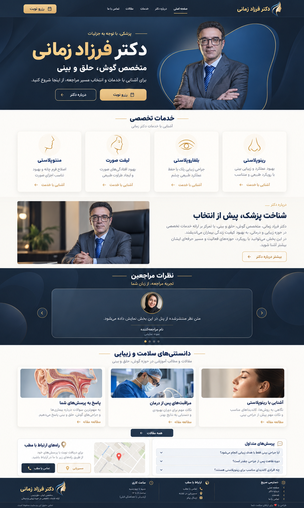

# مرحله۸ — پیشنهاد بصری صفحه اصلی، concept-v1

2026-10-02؛ مالک گفت «طراحی جدید رو الان انجام بدیم، یه طرح بصری بکش ببینم چطوری میشه بهترش کرد». تعویق طراحی برای شروع بررسی بصری پایان یافته است؛ درخواست جاری یک پیشنهاد تصویری است و ظاهر اجرایی سایت هنوز جایگزین نشده. مرحله۸ کامل نیست.

## جهت طرح

هویت سرمه‌ای/طلایی و عکس عمومی پزشک حفظ شده است. هیرو و هدر تیره با نام طلایی و متن تخصص سفید، دکمه رزرو مشخص، فضای خالی و سلسله‌مراتب خواناتر؛ خدمات با کارت ساده؛ معرفی پزشک در دو ستون؛ نظرات با عکس، نام و متن داخل کاروسل تیره/شیشه‌ای؛ مقاله‌های صفحه اصلی در سه کارت؛ FAQ و ارتباط با مطب؛ فوتر با عنوان سفید. این تصویر فقط homepage است و تغییر قالب صفحه مستقل مقالات را تعیین نمی‌کند. سه کارت حذف‌شده AboutUs بازگردانده نشده‌اند. وضعیت فعال/خاموش رزرو در صفحه اصلی نوشته نمی‌شود.

## خروجی و بررسی

مهارت imagegen و ابزار داخلی ساخت تصویر استفاده شد؛ تصویر پزشک، لوگوی عمومی ریپو و screenshot ارائه‌شده مالک مرجع بودند. PNG به ابعاد971×1619 و1574700bytes ذخیره/بازخوانی شد؛ SHA256: `59df4e073488c0d81f574be1c6e80b96bb74a3174c410f2c13b6c622b8463a1e`. تصویر به‌صورت بصری برای رنگ، وجود CTA، نام/عکس/متن نظرات و ساختار کلی دیده شد. فایل تصویر و دستور ادامه کنار outputs هم هستند. تصویر خروجی raster است؛ HTML/CSS، عملکرد فرم، contrast اندازه‌گیری‌شده، mobile، accessibility، SEO و اتصال جدید backend در این مرحله آزموده/پیاده‌سازی نشده‌اند. برای آن‌ها PASS ثبت نشود.

## موارد باز پیش از پیاده‌سازی

- نظر مالک درباره جهت بصری و اصلاحات بعدی؛ تصویر یک کانسپت است، تأیید نهایی طراحی ثبت نشده.
- بخش نمونه‌کار موجود در کانسپت اول نمایش داده نشده؛ حذف قابلیت درخواست نشده و در طرح تکمیلی با گالری محتوای تأییدشده حفظ شود. قبل/بعد ساختگی یا عکس بیمار خصوصی اضافه نشود.
- عکس همراه بخش معرفی و تصاویر مقاله/آواتار، نمایش مفهومی تولیدشده‌اند؛ برای نسخه اجرایی از عکس عمومی تأییدشده پزشک و محتوای دارای مجوز/رضایت استفاده شود. متن/لوکیشن/مدرک یا آمار داخل تصویر، داده مرجع پنل نیست و باید با داده backend تطبیق داده شود. نظر داخل تصویر صریحاً نمونه نمایشی است؛ هیچ نظر واقعی اختراع نشده.
- طراحی موبایل/نوار تماس و مسیر/رزرو، hover/focus و reduced-motion، گالری و صفحات خدمات/SEO جدا باید تکمیل شوند.
- رفتار فعلی رزرو حفظ شود: صفحه اصلی CTA «رزرو نوبت»؛ خاموش→دیالوگ متن مدیر، فعال→سامانه. /appointment/ خاموش فقط پیام و انیمیشن، بدون بارگیری فرم/پنل بیمار/CAPTCHA.

## نسخه مبنا و ادامه

کد اجرایی1.16.0، main `db6de0c24a59b3cedf4ac1b4a4be1d6c8eb1238f`، source تحویل قبل `40ada26346de67ecdf57665db091fd57ef9103e9` و tree `3cc4dad989be879f32414960cccec2a2de06ed58`. PR۱۱ ادغام و CI36969641558 هر۴job موفق:327 Linux و311 Windows/16skip. این نتایج مربوط به کد قبلی‌اند، نه پیاده‌سازی طرح جدید. مرحله۱۰ پذیرش VPS/provider/هویت artifact و production ناتمام باقی است. سایت زنده deploy یا رزرو روشن نشده؛ داده/مالک/payment/SMS واقعی استفاده نشده.

شاخه پیش‌نمایش codex/phase-08-design-preview؛ فایل AI ادامه کنار outputs شامل source دقیق این پیشنهاد پس از commit است. PR طراحی فعلاً draft است، چون مرحله۸ و پذیرش طرح اجرایی هنوز تمام نشده‌اند. اسناد را در هر گام تازه و تغییرات همان مرحله را در همین ریپو ثبت کنید.
